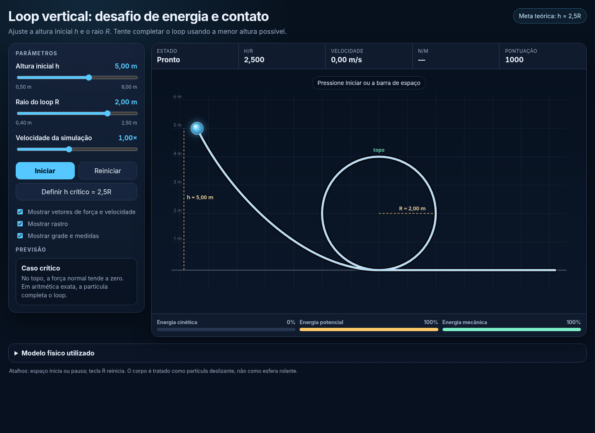

# Vertical-Loop Scientific Core

This directory retains the historical `rollercoster_loop` path for backward compatibility and hosts the shared analytical and numerical scientific modules for the canonical application at [`../vertical-loop/`](../vertical-loop/).

[Open the canonical published simulation](https://ozsp12.github.io/physics_anim/vertical-loop/)



## Physical model

The body is a frictionless point particle of mass \(m\), released from rest at height \(h\) above the lowest point of a circular loop of radius \(R\). Gravity is constant and air resistance and rolling motion are neglected.

With \(\theta\) measured from the lowest point,

\[
y(\theta)=R(1-\cos\theta),
\]

and conservation of mechanical energy gives

\[
v^2(\theta)=2g\left[h-R(1-\cos\theta)\right].
\]

Taking the inward radial direction as positive,

\[
N-mg\cos\theta=\frac{mv^2}{R},
\]

so

\[
\frac{N}{m}=\frac{v^2}{R}+g\cos\theta.
\]

At the critical top state, \(N=0\) and \(v_{\mathrm{top}}^2=gR\), which yields

\[
\boxed{h_{\min}=\frac{5R}{2}}.
\]

## Analytical regimes

Writing \(q=h/R\):

| Range | Predicted behavior |
|---|---|
| \(q<1\) | The particle reaches a turning point and returns. |
| \(q=1\) | The particle reaches the side point with zero speed and zero normal reaction. |
| \(1<q<5/2\) | The normal reaction becomes zero before the top and the particle enters free flight. |
| \(q=5/2\) | Critical completion with zero normal reaction at the top. |
| \(q>5/2\) | The particle completes the loop with positive normal reaction at the top. |

For \(1<q<5/2\),

\[
\cos\theta_{\mathrm d}=\frac{2-2q}{3}.
\]

These boundaries, turning/detachment angles, and scoring rules are centralized in [`physics-model.js`](physics-model.js).

## Numerical implementation

[`simulation-core.js`](simulation-core.js) defines the production timestep

\[
\Delta t=\frac{1}{240}\,\mathrm{s}.
\]

The sampled cubic Bézier ramp and the circular-loop dynamics are integrated numerically using the same production timestep. The velocity obtained at the end of the ramp is carried directly into the loop; the browser application does not replace it with an analytically reconstructed speed.

The numerical suite checks energy drift at the production timestep, convergence under timestep refinement, the \(q=2.49,2.50,2.51\) boundary cases, and ramp-to-loop continuity.

## Application architecture

The user-facing application is now located in [`../vertical-loop/`](../vertical-loop/):

```text
vertical-loop/index.html     semantic application shell
vertical-loop/app.js         controller and simulation state
vertical-loop/renderer.js    Canvas rendering
vertical-loop/ui.js          PT-BR/EN localization and accessibility
vertical-loop/styles.css     presentation
```

This historical directory remains because published URLs may already point to `/rollercoster_loop/`. Its `index.html` therefore redirects to `/vertical-loop/` rather than serving a second copy of the application.

## Validation

From the repository root:

```bash
node --test rollercoster_loop/tests/test_model.js rollercoster_loop/tests/test_integration.js rollercoster_loop/tests/test_numerics.js
python -m unittest discover -s rollercoster_loop/tests -p 'test_model.py' -v
npm install
npx playwright install chromium
npm run test:browser
```

The suites cover the reusable analytical model, production numerical behavior, independent Python reference calculations, application architecture, localization, redirects, accessibility state text, controls, and runtime JavaScript errors in a real Chromium browser.

## Limitations

The model is intended for conceptual and computational-physics education. It excludes rolling inertia, friction, aerodynamic drag, structural deformation, finite vehicle geometry, passenger constraints, and engineering safety analysis. Post-detachment collision handling remains illustrative rather than an engineering contact solver.

## References

See [`../REFERENCES.md`](../REFERENCES.md).
